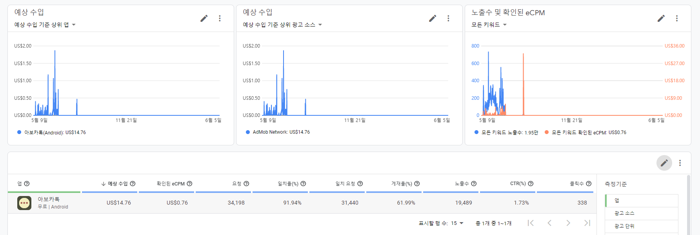
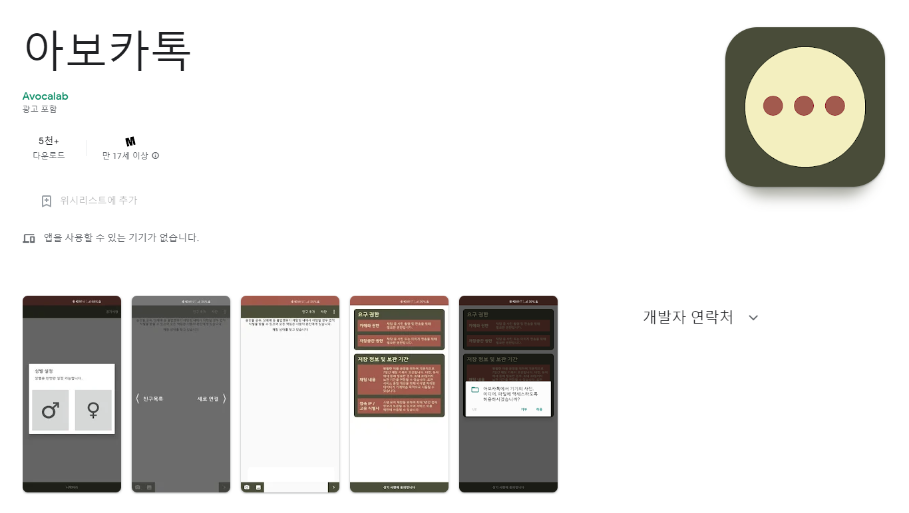
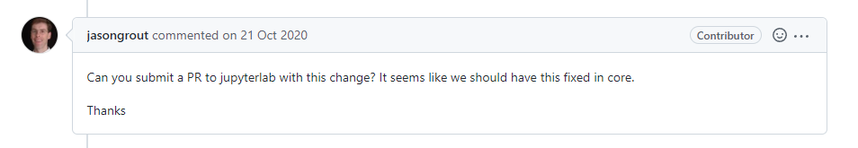
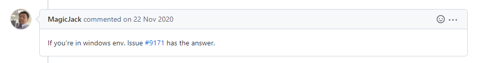
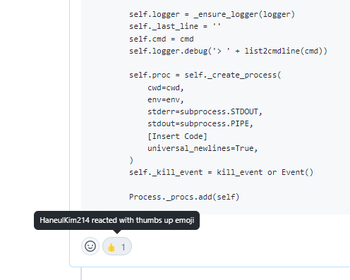

# 개발자 김형준의 Github

백엔드 개발자 김형준입니다.

## 1. 팀 프로젝트
#### 1.1. Tupli :: 유튜브 취향 공유 SNS 서비스

 - 개발 기간: 2022.01 - 2022.02
 - 담당: 프론트엔드
   - 사용자 간 유튜브 실시간 영상 공유 및 채팅 구현
   - 플레이룸(영상 공유용 방) 접근 제어 로직 구현
### 1.2. NFTicket :: NFT 기반 티켓 거래 플랫폼

 - 개발 기간: 2022.02 - 2022.04
 - 담당: 백엔드 (블록체인 개발 전반 개발)
   - ERC721 티켓 발매 및 소유권 변경 Smart Contract 설계 및 구현
   - ERC21 토큰 전송(구매/판매 관련 로직) Smart Contract 설계 및 구현
   - 공연 관련 정보 Smart Contract 설계 및 구현
### 1.3. Parasol :: BaaS 플랫폼 구축을 위한 API 서버 설계/구축 (SBJ DNX 기업 연계 PJT)

 - 개발 기간: 2022.04 - 2022.05
 - 담당: 백엔드 (백엔드 서버 및 은행 측 REST API 서버 개발)
     - *백엔드 서버 - 은행 측 REST API 서버* 간 비동기 통신 모듈 구현 (**Spring 5 WebClient** 사용)
     - C++ 전문 통신 서버 구현 (가상의 전문 통신 양식을 제공 받아 일부 기능을 C++ 전문 통신을 통해 구현)
     - gRPC 전문 통신 클라이언트 구현
     - OAuth 2.0 구글 로그인 구현
     - Spring Cloud Gateway를 이용한 은행 측 REST API 서버 접근 제어 (IP Whitelist, API Key 등)

---

## 2. 토이 프로젝트
### 2.1. 아보카톡 - 안드로이드 랜덤 채팅 어플리케이션

 - 개발 기간: 2019.03 - 2019.05
 - 배포 기간: 2019.05 - 2019.08
 - 다운로드 5000+ 달성

#### 안드로이드 개발 경험
 - Android 9 SDK 사용 경험
 - Push를 위한 Service 구현
 - 채팅방 입장/퇴장 구현
 - Activity 하단에 Admob 광고 구현
 - Constraint Layout 사용 경험 (당시 최신)
 - AAB 배포 경험 (당시 최신)
 - 기존 채팅 앱과 다른 슬라이딩 방식의 UI 구현 (사용 가이드 제공)

#### 백엔드 개발 경험
 - Node.js 서버 구축
 - Socket.IO 이용 Websocket 채팅 방 및 서버 구축
 - 카카오 캐싱 사례를 접하고 Redis 학습을 위해 캐싱 서버 구축
 - 군 복무 및 관련 규제로 인한 관리 어려움으로 운영 중단

#### 어플 운영 당시 구글 Admob 수입
 - 수입 14달러의 *귀여운* 수입

#### 안드로이드 마켓에 등록 
 - 현재 미운영중

### 2.2. 육군 관련 업무 자동화 프로젝트

 - 개발 기간: 2020.03 - 2020.10
 - 업무 중 발생하는 단순 반복 작업 업무를 루틴화하여 루틴별 자동화 프로그램 개발
 - 체감 실질 업무 단계 80% 이상 감소 (11단계 → 2단계)
 - 육군 업무 관련 아이디어 경진대회 우수상 수상 (소장급)

#### 2.3. Active Directory를 활용한 가족 계정 관리 및 홈 서버 구성

 - Synology NAS를 활용한 사진 및 파일 서버 구성
 - Active Directory를 활용한 계정 관리
 - Active Directory를 위한 DNS 및 네트워크 구성(포트 포워딩 등)
 - Let's encrypt 인증서 발급 및 HTTPS 구성

# 3. Open Source 기여
#### 3.1. JupyterLab 플러그인 설치 시(빌드 과정) 발생하는 [CP949 인코딩 문제](https://github.com/jupyterlab/jupyterlab/issues/9171)에 대한 임시 해결책 제시
 

Jupyter의 파생 프로젝트인 [JupyterLab](https://github.com/jupyterlab/jupyterlab)은 Jupyter보다 나은 웹 IDE 환경을 제공하는 프로젝트로, 군 복무(2019-2021) 도중 코딩 공부를 위해 사용 중 버그를 발견하여 해결책과 함께 **Issue Open**

##### Contributer에게 PR 요청을 받았으나 군 복무 중인 관계로 Issue 확인 및 PR이 제한 됨

 
##### 타 사용자에 의해 CJK 사용자들에게 Windows 환경에서 유사 문제 발생시 임시 해결책으로 제안 됨

##### 데이터 엔지니어 김하늘 개발자님(@haneulkim214)의 좋아요 ♥

  
##### 이후, 파생 프로젝트인 Jupyter Server 개발자들이 버그를 해결 한 것으로 판단되어 [Close](https://github.com/jupyterlab/jupyterlab/issues/9171#issuecomment-1146623291)

# 4. 이력
 - 2013.07 한일공동이공계학부 국비유학생 15기(2차 5기) 선발
 - 2014.04 - 2014.10 경희대학교 국비 유학생 사전 교육 
 - 2014.10 - 2015.03 日 오카야마 대학 국비 유학생 사전 교육 
 - 2015.04 - 2019.03 日 오카야마 대학 정보계학과(CS) 재학
 - 2019.10 - 2021.04 대한민국 육군(ROKA) 복무 및 병장 만기 전역
 - 2021.07 - 2022.06 삼성 청년 소프트웨어 아카데미 6기

# 5. Certificates
 - 정보처리기사
 - [日 enPiT-security 8](https://www.seccap.jp/basic/seccap_course.html)
 - JLPT N1
 - JPT 880
 - OPIc IM2

# 6. 계정
 - @hyungjun010 구계정 (사용기간 2015.06.04-2021.07.01)
 - @wasuphj 현재 계정 (사용기간 2021-현재)
